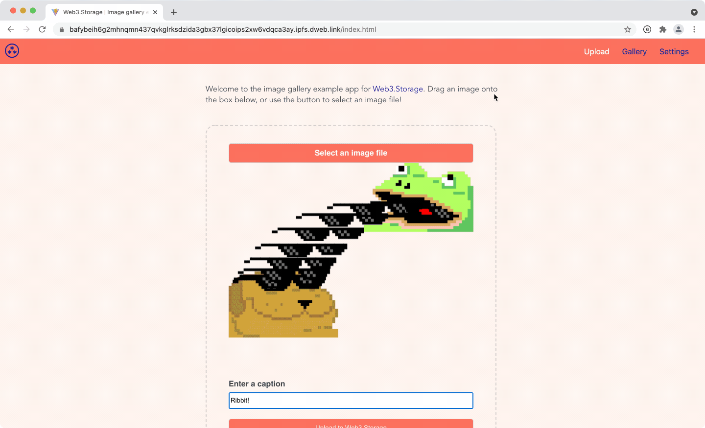

import CodeSnippet from 'components/mdx/CodeSnippet';
import storageJsSource from '!!raw-loader!../../code-snippets/external/example-image-gallery/src/js/storage.js'

To demonstrate how to use the Web3.Storage JavaScript library to build an application, we've written a simple image gallery app for uploading your favorite memes and GIFs to the decentralized web.



You can [play with the app in your browser][example-demo], since it has been uploaded to Web3.Storage and is available using any IPFS HTTP gateway. All you need is an [API token][howto-token] for Web3.Storage.

If you want to run locally, you just need git and a recent version of Node.js. Here's how to start a hot-reloading development server that will update the app as you play with the source code:

```shell
# Clone the repository.
git clone https://github.com/web3-storage/example-image-gallery
cd example-image-gallery

# Install dependencies. This may take a few minutes.
npm install

# Run the app in development mode.
npm run dev
```

Leave the last command running, and open your browser to the URL printed in your terminal, which is usually `http://localhost:3000`.

This guide will walk through some of the code in the example app, focusing on the parts that interact with Web3.Storage.

To see the full code, head to the [web3-storage/example-image-gallery repository on GitHub][github-example-repo]. All the code we'll look at in this guide is contained in [src/js/storage.js][github-storage.js], which handles the interactions with Web3.Storage.

## Token management

When you first start the app, it will check your browser's local storage for a saved API token for Web3.Storage. If it doesn't find one, the app will redirect to `/settings.html`, which displays a form to paste in a token.

Before saving the token, we call a `validateToken` function that tries to create a new Web3.Storage client and call the [`list` method][reference-js-list]. This will throw an authorization error if the token is invalid, causing `validateToken` to return `false`. If `validateToken` returns `true`, we save the token to local storage and prompt the user to upload an image.

<details>
  <summary>validateToken(token)</summary>
  <CodeSnippet lang="js" src={storageJsSource} region="validateToken" />
</details>

:::warning Keep it safe, and keep it secret!
Your API token gives access to your Web3.Storage account, so you shouldn't include a token directly into your front-end source code. This example has the user paste in their own token, which allows the app to run completely from the browser without hard-coding any tokens into the source code.. Alternatively, you could run a small backend service that manages the token and proxies calls from your users to Web3.Storage.
:::

## Image upload

To upload images, we use the [`put` method][reference-js-put] to store a `File` object containing image data. We also store a small `metadata.json` file alongside each image, containing a user-provided caption and the filename of the original image file.

To identify our files for display in the image gallery, we use the `name` parameter to tag our uploads with the prefix `ImageGallery`. Later we'll filter out uploads that don't have the prefix when we're building the image gallery view.

<details>
  <summary>storeImage(imageFile, caption)</summary>
  <CodeSnippet lang="js" src={storageJsSource} region="storeImage" />
</details>

Note that the `storeImage` function uses a few utility functions that aren't included in this walkthrough. To see the details of the `jsonFile`, `getSavedToken`, `showMessage`, `showLink`, and `makeGatewayURL` functions, see [src/js/helpers.js][github-helpers.js]

## Viewing images

To build the image gallery UI, we use the Web3.Storage client's [`list` method][reference-js-list] to get metadata about each upload, filtering out any that don't have our `ImageGallery` name prefix.

<details>
  <summary>listImageMetadata()</summary>
  <CodeSnippet lang="js" src={storageJsSource} region="listImageMetadata" />
</details>

For each matching upload, we call `getImageMetadata` to fetch the `metadata.json` file that was stored along with each image. The contents of `metadata.json` are returned along with an IPFS gateway URL to the image file, which can be used to display the images in the UI.

The `getImageMetadata` function simply requests the `metadata.json` file from an IPFS HTTP gateway and parses the JSON content.

<details>
<summary>getImageMetadata(cid)</summary>
<CodeSnippet lang="js" src={storageJsSource} region="getImageMetadata" />
</details>

:::warning State management at scale
Listing all the uploads and filtering out the ones we don't want works for a simple example like this, but this approach will degrade in performance once a lot of data has been uploaded. A real application should use a database or other state management solution instead.
:::

## Conclusion

The Web3.Storage service and client library make getting your data onto [decentralized storage][concepts-decentralized-storage] easier than ever. In this guide we saw how to use Web3.Storage to build a simple image gallery using vanilla JavaScript. We hope that this example will help you build amazing things, and we can't wait to see what you make!

[howto-token]: ../how-tos/generate-api-token.md
[reference-js-put]: ../reference/js-client-library.md#store-files
[reference-js-list]: ../reference/js-client-library.md#list-uploads
[concepts-decentralized-storage]: ../concepts/decentralized-storage.md

[github-example-repo]: https://github.com/web3-storage/example-image-gallery
[github-storage.js]: https://github.com/web3-storage/example-image-gallery/blob/main/src/js/storage.js
[github-helpers.js]: https://github.com/web3-storage/example-image-gallery/blob/main/src/js/helpers.js
[example-demo]: https://bafybeih6g2mhnqmn437qvkglrksdzida3gbx37lgicoips2xw6vdqca3ay.ipfs.dweb.link
